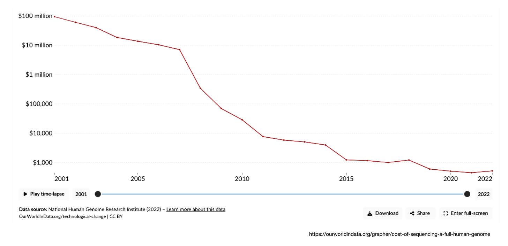
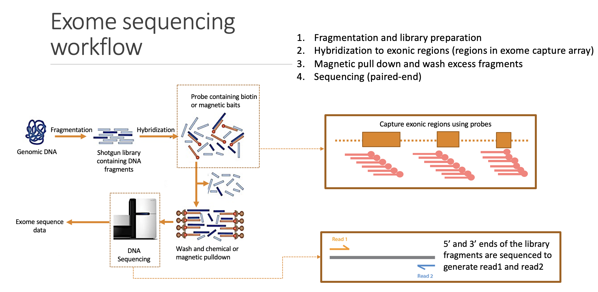

# Introduction to NGS

## Next Generation Sequencing (NGS)

- DNA Sequencing process
  - Process of determining the order of nucleotides in a genome (genome codes the complete set of instructions for cellular functions)
- Next Generation Sequencing (NGS)
  - Increasing the throughput by massively parallelising the sequencing process

## Sequencing throughput and sequencing cost

- Today, we are no longer limited by the availability of sequencing data due to the rapidly decreasing cost

### Sequencing cost over the years

### Sequencing throughput over the years



[Sequencing tech used in the Human Genome Project](https://x.com/broadinstitute/status/472019681268998144?lang=en)

## Main steps of DNA sequencing



## NGS data analysis (Germline variant calling)

### Main steps in NGS analysis

```{mermaid}

   graph TD;
      i1(Raw data) --> 1
      i2(Reference data) --> 1
      1(Mapping raw data onto the reference)
      1 -- Alignment file --> 2
      2(Optimization & fine-tuning of the alignment file)
      2 -- Optimised & fine-tuned alignment file --> 3
      3(Identify DNA changes)

      classDef highlight fill:#99ccff;
      classDef white fill:#ffffff;
      class 1,2,3, highlight;
```

### Precision genomics

- Tailoring disease prevention and treatment based on the person’s genetic makeup
- Here, we analyse raw sequencing data and identify changes in DNA that could lead to a diseases

### Precision genomics in routine clinical practice

- Sequence analysis workflows are routinely used in current clinical setting
- However they all (a large majority) use CPUs for the computing power

