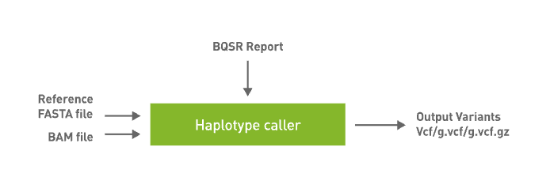

# NVIDIA Parabricks

- Parabricks offers range of accelerated NGS data processing tools/commands
- [Parabricks documentation](https://docs.nvidia.com/clara/parabricks/latest/index.html):
  - Parabricks was built from the ground up by GPU computing and Deep Learning experts who wanted to develop the fastest and most efficient possible implementation of common genomics algorithms.

- We can use these commands and create a simple NGS data processing workflows with two main stages
  - Read mapping and alignment refinement
  - Variant calling


*[Ref:](https://docs.nvidia.com/clara/parabricks/latest/overview.html)*

## Parabricks workflow (basic workflow)

### Stage 1: Read mapping and alignment refinement

#### Step 1: fq2bam


*[Source](https://docs.nvidia.com/clara/parabricks/latest/documentation/tooldocs/man_fq2bam.html)*

#### Step 2: applybqsr

- Compatible GATK4 Command: `gatk ApplyBQSR`

### Stage 2: Variant calling

#### Parabricks HaplotypeCaller



*[Source](https://docs.nvidia.com/clara/parabricks/latest/documentation/tooldocs/man_haplotypecaller.html)*

## [Hands-on session: Link](https://md.sigma2.no/s/pkNh37CG-)

### Results

#### Output files

```none
-rw-r--r-- 1 root      root      4819386868 Dec  4 14:11 pbrun_fq2bam_GPU.bam
-rw-r--r-- 1 root      root         6882792 Dec  4 14:11 pbrun_fq2bam_GPU.bam.bai
-rw-r--r-- 1 root      root        22693986 Dec  4 14:26 pbrun_fq2bam_GPU.bam_applybqsr.vcf
-rw-r--r-- 1 root      root      4947983325 Dec  4 14:18 pbrun_fq2bam_GPU_applybqsr.bam
-rw-r--r-- 1 root      root         6882792 Dec  4 14:18 pbrun_fq2bam_GPU_applybqsr.bam.bai
-rw-r--r-- 1 root      root           87690 Dec  4 14:11 pbrun_fq2bam_GPU_chrs.txt
-rw-r--r-- 1 root      root          395623 Dec  4 14:11 pbrun_recal_gpu.txt
```

#### Variant counts

```none
grep -vc "#" pbrun_fq2bam_GPU.bam_applybqsr.vcf
> 127720
```
