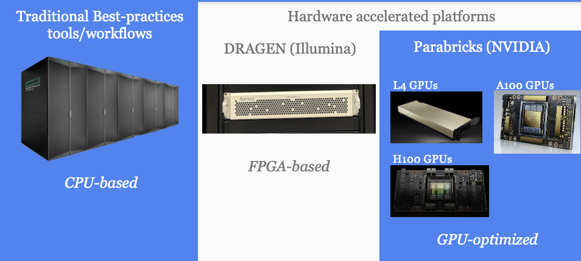
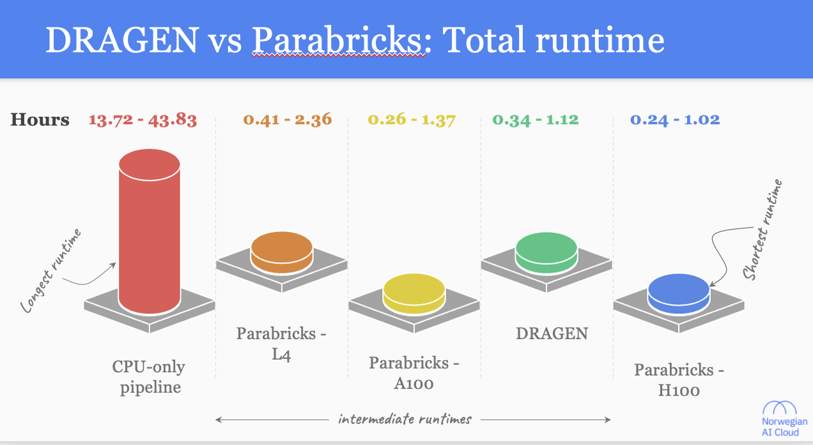
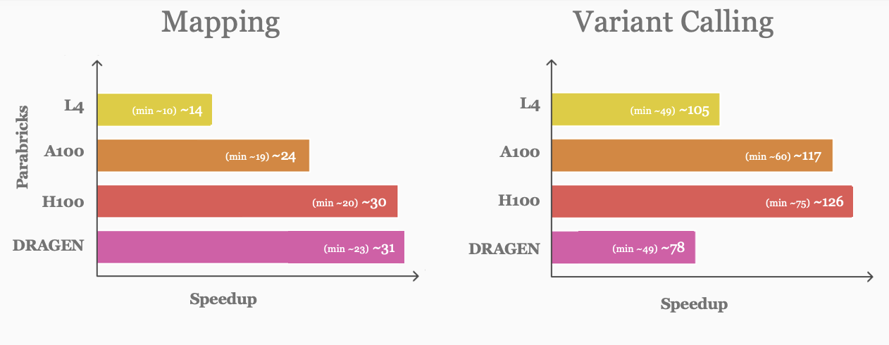
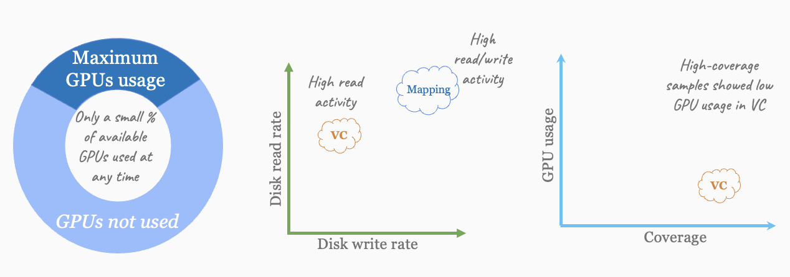
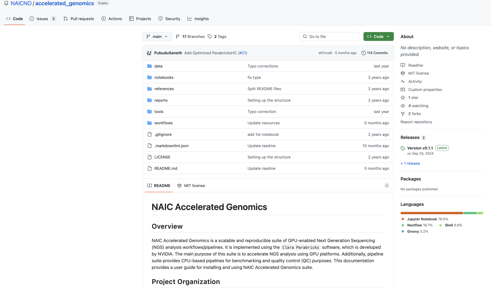

# Benchmarking accelerated next-generation sequencing analysis pipelines

## Our Accelerated NGS analysis benchmark paper

* **[Link to the paper](https://academic.oup.com/bioinformaticsadvances/article/5/1/vbaf085/8132977)**

### Hardware Platforms for NGS analysis

:::{solution} Hardware accelerated platforms

:::

### Significant performance gain can be achieved with any accelerated platform

:::{solution} Runtime comparison

*Above is a cartoon figure to highlight the patters the original paper contains correct figures*
:::

### Speedup ## Quantify performance improvements (Speedup  = CPU-only runtime ÷ Accelerated runtime)

### Variant calling showed higher speedup than Mapping

:::{solution} Speedup comparison

*Above is a cartoon figure to highlight the patters the original paper contains correct figures*

:::

### Parabricks resource usage provided new insights

:::{solution} Profiling Parabricks

*Above is a cartoon figure to highlight the patters the original paper contains correct figures*
:::

### Optimizing Parabricks for further performance gains

:::{solution}

*Above is a cartoon figure to highlight the patters the original paper contains correct figures*
:::

### Parabricks and DRAGEN, speedup and cost consideration

:::{solution} Practical Selection Framework

*Above is a cartoon figure to highlight the patters the original paper contains correct figures*
:::

## Accelerated NGS analysis NextFlow pipeline

